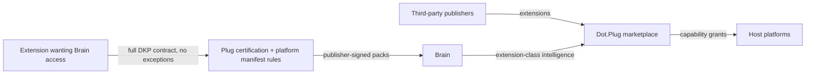

# Dot.Plug

> **Platform-owned source:** [Dot.Plug's wiki.md](https://github.com/sakhilebhayi/Dot.Plug/blob/main/wiki.md) — the platform's own knowledge home. This document is Dot.Brain's ingested view; the wiki is authoritative for what the platform actually is.

## 1. Purpose & Business Domain

The ecosystem's extension platform: a marketplace and runtime for third-party extensions that add capabilities to Dot platforms — integrations, connectors, domain add-ons, and vertical tools built by developers outside the ecosystem's core teams. Owns the extension domain: extension identities, capability grants, and marketplace health. Plug's relationship to the Brain is defined by a deliberate asymmetry rooted in brain.future.md's explicit non-reservation of the extension surface: **the Brain governs how extensions touch the ecosystem; it does not govern what extensions are.** Extension innovation stays unreserved — but any extension that wants to *publish knowledge into* or *consume intelligence from* the Brain crosses a hard boundary (§6) where the full DKP discipline applies without exception. Third-party status buys no shortcut and imposes no extra tax: the contract is the contract.

## 2. Entities Owned (extension entity model — registry gap closed)

| Entity | Graph node type | Natural key | Notes |
|---|---|---|---|
| Publisher | `entity:site` | publisher ID | Verified developer/org; tenant root |
| Extension | `entity:asset` | publisher + extension ID | Version-attributed |
| Capability grant | `entity:process` | extension + platform + scope | What the extension may touch, per installing org |
| Installation (aggregate class) | `entity:process` | extension × platform × org-cohort | Individual org installs aggregate at n ≥ 20 |
| Marketplace observation | `observation` | extension-class × window | Adoption/retention/health aggregates |
| Extension outcome | `outcome` | extension + review period | Post-certification behavior vs. declared capabilities |
| Extension internal data | — | — | **Never graphed.** What an extension does inside its own scope is the publisher's business — the type-level exclusion applied to third-party IP |

The model's key decision: extensions are graphed as *capability holders*, not as code. The Brain knows what an extension is entitled to touch and how the class behaves in aggregate — never its internals, algorithms, or per-customer data.

## 3. Events Emitted

| Event | Trigger | Consumers | Frequency |
|---|---|---|---|
| `extension.certified/decertified` | Certification lifecycle | All platforms (capability trust), Brain | low |
| `extension.grant.issued/revoked` | Capability grant change | Granting platform, audit log | ~10¹/day |
| `extension.behavior.anomaly` | Runtime behavior outside declared capabilities | Security Agent, publisher | rare — target 0 |

## 4. Knowledge Packs Published

| Payload type | Cadence | Example pack ID |
|---|---|---|
| observation (marketplace-health, extension-class aggregates) | monthly | `dkp:plug:obs:2026-07-01:0004` |
| insight (capability-pattern findings) | per finding | `dkp:plug:ins:2026-06-05:0001` |
| outcome (recommendation verifications) | per verified recommendation | `dkp:plug:out:2026-07-29:0001` |
| incident (certification failures, capability breaches) | per incident | `dkp:plug:inc:2026-06-14:0001` |

## 5. Intelligence Consumed

| Recommendation type | Metric expected to move | Baseline |
|---|---|---|
| Capability-risk scoring for certification review (grant patterns preceding anomalies) | `extension.anomaly_rate` | 2026 H1 |
| Marketplace-gap suggestions (unmet integration demand — Pulse topic signals are a natural source) | `extension.category_coverage_rate` | per platform |
| Review-prioritization (which recertifications to expedite) | `extension.recert_backlog_days` | 2026 H1 |

## 6. Cross-Platform Relationships & the Third-Party Boundary



**The third-party boundary, wired:** an extension that wants Brain access must (a) hold a Plug certification covering the specific payload types, (b) sign packs with its own publisher key — provenance says the extension, never the host platform, so trust accrues (and burns) to the publisher, (c) pass the *host platform's* manifest rules — an extension on HR inherits HR's field-classification gate; on Charts, the MNPI screen; the strictest applicable rule always wins, and (d) start at trust 0.50 like every publisher, earning upward through verified outcomes. What is *not* required: any Brain relationship at all. An extension that never touches the Brain needs only its capability grants — the unreserved surface future.md promised stays unreserved.

Seams: marketplace payments are Billing settlements; extension listing/discovery UX borrows Emall's matching domain but extension *certification* is Plug's alone.

## 7. Tenancy Model

Tenant key = publisher for marketplace data; installing org for installation data — dual-keyed because both have confidentiality stakes. Floors: n ≥ 20 installing orgs per extension-class cell; single-extension data publishes only with publisher consent (their commercial performance is their data — the sovereignty principle applied to developers). Capability grants are always auditable by the granting org.

## 8. Dopamine Surface

Marketplace mechanics have prohibited-list instantiations aimed at *developers*: download-count leaderboards, trending-rank pressure, review-score gamification — all withheld; a marketplace that rewards visibility mechanics over capability quality fills with engagement-optimized extensions, which is the ecosystem-level version of the proxy-metric failure. Shared: certification status, capability-transparency labels (what an extension can touch, rendered to installing orgs before grant — the acid test as a marketplace listing requirement), and per-extension outcome performance where the publisher opts in.

## 9. Active Recommendations

Maintained by the Registry Agent. Current: capability-risk scoring `verified` — see §13; marketplace-gap suggestion for agri-equipment telemetry connectors `open` (expiry 2026-09-18).

## 10. Incident History Summary

One incident pack (2026-06): a certified logistics connector began reading a data scope adjacent to its grant after a host-platform schema change widened a field's exposure — caught by runtime anomaly detection, grant suspended, republished as an incident with the schema-change interaction named as the root cause; lesson: capability grants re-validate automatically on host schema changes. Consumed: Charts' instrument-mapping lesson (the same "the world changed under a static rule" failure shape).

## 11. Domain Metrics (registered per brain.metrics.md §4.8)

| ID | Type | Definition |
|---|---|---|
| `extension.anomaly_rate` | ratio | Extensions with runtime behavior outside declared capabilities / active certified extensions, quarterly |
| `extension.category_coverage_rate` | ratio | Platform integration categories with ≥ 1 certified extension / categories with demonstrated demand |
| `extension.recert_backlog_days` | duration | Oldest pending recertification age — certification-throughput health |

## 12. Manifest (platform.dkp.json example)

```json
{
  "platform_id": "dot-plug",
  "dkp_version": "1.0.0",
  "signing_key_ref": "vault://keys/dot-plug/dkp-signing/v1",
  "publishes": ["observation", "insight", "outcome", "incident"],
  "subscribes": ["capability-risk-scoring", "marketplace-gap", "review-prioritization"],
  "schemas": { "knowledge-pack": "1.0.0", "metric": "1.0.0" },
  "default_classification": "ecosystem",
  "tenancy": {
    "key": "publisher_id|installing_org_id",
    "aggregation_floor": 20,
    "publication_rules": [
      { "rule": "publisher-consent-for-single-extension-data", "enforcement": "reject-at-ingestion" },
      { "rule": "third-party-packs-publisher-signed", "enforcement": "reject-at-ingestion" },
      { "rule": "host-manifest-inheritance", "note": "strictest applicable host rule wins", "enforcement": "reject-at-ingestion" }
    ]
  }
}
```

## 13. Worked round-trip

1. **Pack:** `dkp:plug:obs:2026-07-01:0004` — capability-grant and anomaly aggregates across the certified extension base: extensions granted broad read scopes at certification but using < 30% of them showed 3× the anomaly rate of narrowly-scoped peers (over-granting is itself a risk signal), 214 extensions, 41 publisher cohorts.
2. **Validation → graph:** `OBSERVED_WITH` edge between grant-breadth-vs-usage ratio and anomaly incidence, 0.72; corroborated by the 2026-06 incident's root-cause shape (schema change × wide grant) (×1.10 → 0.79).
3. **PR back (capability-risk scoring):** add grant-utilization review to recertification — unused scopes proposed for narrowing at each cycle; confidence 0.79 provisional, ships as reviewer guidance with Extension Agent confirmation per case; impact `extension.anomaly_rate` −30% predicted, guard `extension.recert_backlog_days` flat (the review must not slow certification), expiry 90 days.
4. **Outcome:** `dkp:plug:out:2026-07-29:0001` — anomaly rate −34% verified in the treated recertification cohort; backlog guard held; confidence 0.85, fourth provisional-band graduation. Least-privilege emerges as evidence-backed marketplace policy rather than imposed doctrine — the Brain teaching the platform its own security posture from its own data.

## Change Log

| Version | Date | Author | Change |
|---|---|---|---|
| 1.0.0 | 2026-08-01 | Platform Integrator (prompt 05, AI) | Initial integration package: extension entity model closed (capability holders, not code; internals excluded at type level), third-party boundary wired (publisher-signed packs, host-manifest inheritance, trust from 0.50, no mandatory Brain relationship — future.md non-reservation honored), dual-keyed tenancy with publisher consent rule, developer-aimed prohibited patterns withheld, 3 domain metrics, worked round-trip |

| 1.0.1 | 2026-08-01 | Repository Steward Agent | Linked to Dot.Plug's own wiki.md (platform repo) as the platform-owned source of truth |

## Open Questions

| Question | Owner → Approver |
|---|---|
| Publisher trust portability: does a publisher's earned trust apply per extension or per publisher across their portfolio? | Extension Agent → Chief Architect |
| Extension-emitted domain metrics: may a certified extension register metrics in its host platform's namespace, or does it need a publisher-scoped namespace? | Registry Agent → Chief Knowledge Engineer |
