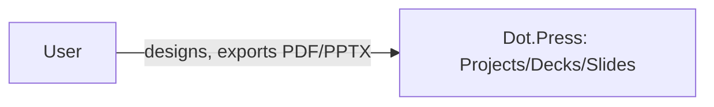

# Dot.Press

> **Platform-owned source:** [Dot.Press's wiki.md](https://github.com/sakhilebhayi/Dot.Press/blob/main/wiki.md) — the platform's own knowledge home. This document is Dot.Brain's ingested view; the wiki is authoritative for what the platform actually is.

## 1. Purpose & Business Domain

**Domain correction (2026-08-02):** despite the ecosystem registry's `newspaper` icon suggesting a newsroom/CMS product, the real, built codebase is a presentation/slide-deck design tool (Canva/Google-Slides-shaped): a Konva+Tiptap canvas editor, AI slide generation/rewrite with an honest `mock` fallback (not a fabricated result), PDF/PPTX export, and a full authorized CRUD API backed by 5 Policies. Real entities: Project, Deck, Slide, Asset, AiUsageLog. Architecturally distinct from its 6 siblings: this app uses Jetstream's Inertia+Vue 3 stack, not Livewire — a genuine divergence, not an oversight (`config/jetstream.php: 'stack' => 'inertia'`).

## 2. Entities Owned

| Entity | Graph node type | Natural key | Notes |
|---|---|---|---|
| Project | `entity:asset` | project ID | User-owned, no team-sharing yet |
| Deck | `entity:asset` | deck ID | Belongs to a Project |
| Slide | `entity:asset` | slide ID | Belongs to a Deck |
| Asset | `entity:asset` | asset ID | Uploaded media |
| AiUsageLog | `observation` | log ID | AI generation/rewrite calls, cost tracking |

## 3. Events Emitted

None currently mapped to DKP.

## 4. Knowledge Packs Published

None. No DKP manifest or publish pipeline exists.

## 5. Intelligence Consumed

None currently subscribed.

## 6. Cross-Platform Relationships

No cross-platform data exchange with other Dot Ecosystem platforms yet beyond shared ecosystem SSO and the shared `infodot` database.

## 7. Tenancy Model

Single-`user_id`-owned (no team-sharing model built yet). Every by-ID controller action in `app/Http/Controllers/Api/` authorizes via one of 5 Policies, consistently scoped by real ownership chains — the integration pass's security scan came back clean, no IDOR found.

## 8. Dopamine Surface

None identified as in-scope.

## 9. Active Recommendations

None — no Knowledge Pack publishing yet.

## 10. Incident History Summary

None recorded as a live incident. Real defect found and fixed during the 2026-08-02 integration pass: `/dashboard` was completely broken — `routes/web.php` rendered a Blade view (`dashboard`) that doesn't exist in this Inertia-based app (only an Inertia page component, `Dashboard.vue`, exists). Fixed by switching to `Inertia::render('Dashboard', [...])` with the exact prop shape the Vue component expects — verified by reading `Dashboard.vue` directly, not guessed. Also removed a dead Livewire-stack layout file (`@livewireStyles`/`@livewire(...)` directives) left over despite this app having no `livewire/livewire` dependency at all.

## Change Log

| Version | Date | Author | Change |
|---|---|---|---|
| 1.0.0 | 2026-08-02 | Repository Steward Agent | Initial registration. Platform audited: real domain corrected (slide-deck design tool, not newsroom), a fully broken /dashboard route fixed (wrong frontend stack assumption), SSO contract verified clean, security scan came back clean, README corrected, stale `TASK_LIST.md` "real-time collaboration" claim scoped down to what's actually built (cache-based presence + optimistic locking). |

## Open Questions

| Question | Owner → Approver |
|---|---|
| `os/Appendix.md`'s `newspaper` icon no longer matches this platform's real domain — should it be updated? | Registry Agent → Chief Knowledge Engineer |
| Should team-sharing be added, or is single-user ownership the intended model for this platform? | Press Platform Lead → Chief Architect |
