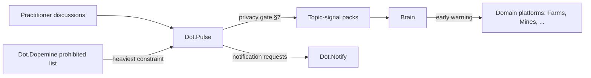

# Dot.Pulse

## 1. Purpose & Business Domain

The ecosystem's social and discussion platform: communities of practice, Q&A threads, announcements, and peer knowledge exchange across organizations. Owns the discussion domain: threads, communities, moderation records. Pulse's relationship to the Brain is unusual — its raw material is human conversation, which is simultaneously the richest possible knowledge source and the most privacy-sensitive. The **discussion-pack privacy review** (registry gap, closed in §7) resolves this tension: what may leave the platform is *thematic aggregates*, never conversational content. And as the platform where prohibited-metric patterns naturally concentrate (likes, streaks, follower counts, viral mechanics), Pulse is dot-dopemine's heaviest constraint consumer (§8).

## 2. Entities Owned

| Entity | Graph node type | Natural key | Notes |
|---|---|---|---|
| Community | `entity:site` | community ID | Tenant sub-scope; may be cross-org |
| Thread | `entity:process` | thread ID | Content never leaves the platform |
| Topic-signal observation | `observation` | topic × community-cohort × window | Thematic aggregate only, per §7 |
| Answered-question outcome | `outcome` | thread + resolution | Resolution ground truth (accepted answer, time-to-answer) |
| Moderation record | `entity:process` | case ID | Platform-internal; aggregates only publishable |

## 3. Events Emitted

| Event | Trigger | Consumers | Frequency |
|---|---|---|---|
| `social.thread.resolved/expired` | Q&A resolution lifecycle | Brain (aggregate), community dashboards | ~10²/day |
| `social.topic.trending` | Topic-signal threshold crossed (post-privacy-gate) | Brain, Dot.Notify | low |
| `social.moderation.case_closed` | Moderation resolution | Brain (aggregate only) | low |

## 4. Knowledge Packs Published

| Payload type | Cadence | Example pack ID |
|---|---|---|
| observation (topic signals, resolution-rate aggregates) | weekly | `dkp:pulse:obs:2026-07-13:0011` |
| insight (recurring-problem findings from topic clusters) | per finding | `dkp:pulse:ins:2026-06-20:0002` |
| outcome (recommendation verifications) | per verified recommendation | `dkp:pulse:out:2026-07-28:0001` |
| incident (privacy-gate failures, moderation-pattern incidents) | per incident | `dkp:pulse:inc:2026-04-18:0001` |

**The topic-signal pack — Pulse's distinctive contribution:** when practitioners across ≥ 5 organizations independently discuss the same operational problem, that convergence is evidence the Brain can get nowhere else — often *before* the problem shows up in any platform's metrics. The pack carries topic label, community-cohort size, trend direction, and links to which platform domain it concerns. It carries zero quotes, zero usernames, zero thread links.

## 5. Intelligence Consumed

| Recommendation type | Metric expected to move | Baseline |
|---|---|---|
| Expertise-routing (route unanswered questions to communities with resolution history) | `social.question_resolution_rate` | 2026 H1 |
| Community-seeding (propose a community where topic signals show unmet demand) | `social.time_to_first_answer_p50` | per topic |
| Cross-platform early warnings (a topic signal names a domain problem → domain platform alerted) | domain platform's metric | per signal |

## 6. Cross-Platform Relationships



Early-warning example: Kolomela-adjacent haul-road discussions trended in mining communities weeks before the 2026-03 wet-season observation packs landed — retrospectively, the topic signal was the chain's earliest evidence. Topic signals are I4-grade (uncontrolled, self-selected populations); they seed hypotheses, never verify them.

## 7. Tenancy Model & Discussion-Pack Privacy Review (registry gap closed)

Tenant key = organization; communities may span tenants (cross-org communities are `ecosystem`-scoped by construction). The **privacy-review contract** every discussion-derived pack must pass before signing:

| Gate | Rule |
|---|---|
| Content exclusion | No quotes, paraphrases, usernames, thread IDs, or community names below cohort floor — topic labels come from the shared taxonomy, not from member text |
| Cohort floor | n ≥ 50 distinct participants per topic × window; cross-org signals additionally ≥ 5 distinct organizations |
| Re-identification check | Topic × cohort × window combination tested against small-cell intersection before publication |
| Moderation exclusion | Moderation data publishable only as platform-level quarterly aggregates; never per community |
| Human sign-off | Security Officer approves the gate *configuration*; per-pack passage is then mechanical (manifest-declared, validated at ingestion) |

## 8. Dopamine Surface (heaviest prohibited-list consumer)

Every prohibited-metric pattern (dot-dopemine §7) has a natural social instantiation, and Pulse withholds them all: like/upvote counts as targets (raw engagement), posting streaks (loss-framed streaks), follower/karma leaderboards (person-vs-person rate metrics), notification-driven re-engagement loops (abandonment nudges), algorithmic virality feeds (variable-ratio rewards). What Pulse *does* share: question-resolution rate and time-to-first-answer — communities are for getting answered, and the only certified mechanic deployed is accepted-answer recognition (outcome-anchored: the question was actually resolved). Pulse is the standing test case for whether a social platform can run on outcome mechanics alone; its coupling data feeds dot-dopemine's evidence base.

## 9. Active Recommendations

Maintained by the Registry Agent. Current: expertise-routing `verified` — see §13; community-seeding for a post-harvest-storage topic cluster `open` (expiry 2026-09-10).

## 10. Incident History Summary

One incident pack (2026-04): a draft topic-signal pack included a community name whose small size made members identifiable — caught by the re-identification check pre-publication, published as an incident anyway (near-miss transparency); lesson hardened the small-cell rule into the mechanical gate. Consumed: dot-dopemine's decertified-streak lesson at catalog-subscription time.

## 11. Domain Metrics (registered per brain.metrics.md §4.8)

| ID | Type | Definition |
|---|---|---|
| `social.question_resolution_rate` | ratio | Threads with accepted answer / question threads, monthly |
| `social.time_to_first_answer_p50` | duration | Question posted to first substantive answer, median |
| `social.topic_signal_precision` | ratio | Topic signals later corroborated by domain-platform evidence / signals published — is the early-warning channel real? |

## 12. Manifest (platform.dkp.json example)

```json
{
  "platform_id": "dot-pulse",
  "dkp_version": "1.0.0",
  "signing_key_ref": "vault://keys/dot-pulse/dkp-signing/v1",
  "publishes": ["observation", "insight", "outcome", "incident"],
  "subscribes": ["expertise-routing", "community-seeding", "early-warning"],
  "schemas": { "knowledge-pack": "1.0.0", "metric": "1.0.0" },
  "default_classification": "ecosystem",
  "tenancy": {
    "key": "org_id",
    "aggregation_floor": 50,
    "publication_rules": [
      { "rule": "discussion-privacy-gate", "min_orgs_cross_tenant": 5, "enforcement": "reject-at-ingestion" }
    ]
  }
}
```

## 13. Worked round-trip

1. **Pack:** `dkp:pulse:obs:2026-07-13:0011` — topic-signal aggregates showing agronomy communities' unanswered post-harvest-storage questions clustering (n = 83 participants, 7 orgs; all §7 gates pass) alongside a storage-specialist community with 0.91 resolution rate.
2. **Validation → graph:** `OBSERVED_WITH` edge between question-topic cluster and the specialist community's resolution history, 0.70; corroborated by Farms' post-harvest-loss observations (×1.10 → 0.77) — the social signal and the operational metric agree.
3. **PR back (expertise-routing):** route storage-topic questions to the specialist community; confidence 0.80, impact `social.time_to_first_answer_p50` −30% predicted for the topic, guard `social.question_resolution_rate` flat-or-better, expiry 45 days.
4. **Outcome:** `dkp:pulse:out:2026-07-28:0001` — −37% time-to-first-answer verified against pre-routing baseline; resolution rate up 4 points. Side effect logged for `social.topic_signal_precision`: the same topic cluster was forwarded to Dot.Farms as an early warning, corroborated by its own loss data — first precision-numerator entry.

## Change Log

| Version | Date | Author | Change |
|---|---|---|---|
| 1.0.0 | 2026-08-01 | Platform Integrator (prompt 05, AI) | Initial integration package: discussion-domain ownership, discussion-pack privacy review closed as five-gate mechanical contract, topic-signal packs as I4 early-warning channel, all five prohibited-list patterns withheld (standing outcome-mechanics-only test case), 3 domain metrics, worked round-trip |
| 1.0.1 | 2026-08-01 | Repository Reviewer (prompt 07, AI) | Notify-consent OQ struck (resolved by dot-notify.md) |
| 1.0.2 | 2026-08-01 | DKP Architect (prompt 02, AI) | Taxonomy OQ struck (schemas/taxonomy.json published) |

## Open Questions

| Question | Owner → Approver |
|---|---|
| ~~Topic labels depend on the shared taxonomy — third consumer waiting on schemas/taxonomy.json (with Emall and semantic)~~ **Resolved 2026-08-01:** [schemas/taxonomy.json](../schemas/taxonomy.json) published; `social.topic.signal` frozen | Knowledge Agent → Chief Knowledge Engineer |
| ~~Cross-org early warnings to a domain platform: does the receiving platform's human lead need notification-consent configuration in Dot.Notify? Resolve in dot-notify's session~~ **Resolved 2026-08-01** by [dot-notify.md](dot-notify.md): `cross-org-early-warning` scope, default-off, role-addressed, degrade-to-digest | Community Agent → Security Officer |
