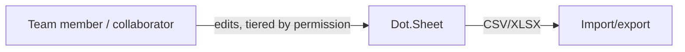

# Dot.Sheet

> **Platform-owned source:** [Dot.Sheet's wiki.md](https://github.com/sakhilebhayi/Dot.Sheet/blob/main/wiki.md) — the platform's own knowledge home. This document is Dot.Brain's ingested view; the wiki is authoritative for what the platform actually is.

## 1. Purpose & Business Domain

A genuine spreadsheet platform: a virtual-scrolled cell grid, a client+server formula engine, real-time multi-user collaboration via Reverb, comments, full version history, chart generation, CSV/XLSX import/export, and AI panels (formula generation, natural-language query, data cleaning, OCR, sentiment) backed by a swappable provider defaulting to Ollama, not a confirmed Claude integration as older docs implied.

## 2. Entities Owned

| Entity | Graph node type | Natural key | Notes |
|---|---|---|---|
| Spreadsheet | `entity:asset` | spreadsheet ID | Owner + optional team, sharable |
| Cell | `entity:asset` | spreadsheet × row × col | Formula + value |
| SharedUser | `entity:process` | spreadsheet × user | Tiered permission: view/comment/edit/admin |
| VersionHistory | `observation` | spreadsheet × version | Full history, restorable |
| ChartConfig | `entity:asset` | chart ID | Generated from sheet ranges |
| CellComment | `entity:asset` | comment ID | Cell-anchored, threaded |

## 3. Events Emitted

Real-time Reverb broadcast events for collaborative editing exist internally but are not yet DKP-mapped ecosystem events.

## 4. Knowledge Packs Published

None. No DKP manifest or publish pipeline exists.

## 5. Intelligence Consumed

None currently subscribed.

## 6. Cross-Platform Relationships

No cross-platform data exchange with other Dot Ecosystem platforms yet beyond shared ecosystem SSO and the shared `infodot` database.

## 7. Tenancy Model

Owner/team/tiered-share scoped via `SpreadsheetPolicy` (view / update / comment / manageSharing / delete, each checking owner, team-with-edit, or explicit share-tier). The integration pass found and closed the most severe finding across all 7 newly-integrated platforms: `SpreadsheetController` correctly authorized every action, but six Livewire sub-components (`ChartBuilder`, `CellCommentsPanel`, `SpreadsheetToolbar`, `AiFormulaModal`, `AiAnalysisPanel`, `VersionHistoryModal`) had zero authorization checks, and the main grid component only checked `view` at mount without re-checking `update` on mutating actions — meaning view-only and comment-only shared users could actually write cell data, comments, formatting, and charts. Fixed by adding `authorize('update', ...)` (or `authorize('comment', ...)` where appropriate, e.g. comment actions) matching the policy's existing tier logic.

## 8. Dopamine Surface

None identified as in-scope.

## 9. Active Recommendations

None — no Knowledge Pack publishing yet.

## 10. Incident History Summary

None recorded as a live incident, but the tenancy finding in §7 was a real, exploitable privilege-escalation gap (view/comment-tier users could write) — closed before any known exploitation, not after. Also found and fixed: a broken `/dashboard` route left in an inconsistent state by a prior commit (`routes/web.php` was updated but `dashboard.blade.php` still referenced the old variable names, which would throw an undefined-variable error on every visit).

## Verified Infrastructure State (2026-08-07)

Confirmed directly against the real repo during the ecosystem-wide standardization + code-quality pass (full 26-platform summary: [brain.platforms.md](../brain.platforms.md) change log, v1.0.21):

- **Legal/branding/auth** — branded Markdown-mail theme, complete POPIA-aligned Privacy Policy/Terms/Cookie Policy naming **BluePin Inc**, guest auth pages restyled to match the welcome-page hero.
- **Laravel Boost** — `laravel/boost` ^2.5 installed via `composer require --dev --ignore-platform-req=php` (this platform shares `maatwebsite/excel`'s `phpoffice/phpspreadsheet` dependency with dot-forms, which requires `php <8.5.0` against this ecosystem's PHP 8.5.9); `.mcp.json`/`boost.json`/`CLAUDE.md` guideline block in place.
- **Code-quality pass** — Pint: 42 files reformatted, formatting-only. `composer audit`: **26 advisories across 9 packages**, all patched — same combination and fix as dot-forms: `laravel/framework` (signed-URL/CRLF), `phpoffice/phpspreadsheet` → 1.30.6 (SSRF/RCE via `IOFactory::load`, XSS, memory-exhaustion DoS chain), `symfony/*` transitive, `league/commonmark` baseline. `npm audit`: patched `ws` uninitialized-memory-disclosure + memory-exhaustion DoS (via engine.io-client, 11 issues). Full suite reconfirmed green (45 passed / 7 skipped / 89 assertions) after every change.

## Change Log

| Version | Date | Author | Change |
|---|---|---|---|
| 1.0.0 | 2026-08-02 | Repository Steward Agent | Initial registration. Platform audited: SSO contract verified, DB_DATABASE misconfiguration fixed, a broken /dashboard route repaired, a systemic missing-authorization gap across six Livewire components closed (the most severe finding of the 7-platform integration pass), favicon wired into the authenticated layout, README corrected. |

## Open Questions

| Question | Owner → Approver |
|---|---|
| A lower-severity subset remains: settings-only mutations (hide/resize rows, validation rules) still inherit only `view` authorization rather than a dedicated check — flagged, not fixed this pass. | Sheet Platform Lead → Security Agent |
