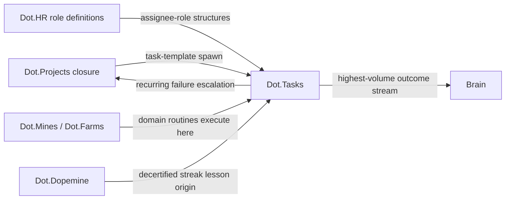

# Dot.Tasks

## 1. Purpose & Business Domain

Recurring operational work: inspection rounds, maintenance routines, compliance checklists, and standing queues. Owns the delivery domain at the *routine* granularity — the counterpart to Dot.Projects under the shared boundary rule: **Projects owns work with end dates; Tasks owns work that recurs** (canonical statement in dot-projects §1; this doc defers to it). Tasks' knowledge value is high-frequency: thousands of small completions produce dense, fast-cycling evidence about how routine work actually behaves — the highest-volume outcome stream in the ecosystem after Notify's deliveries.

## 2. Entities Owned

| Entity | Graph node type | Natural key | Notes |
|---|---|---|---|
| Task template | `entity:asset` | template ID | May be project-spawned (provenance kept) |
| Queue | `entity:process` | org + queue | Health-attributed, never "finished" |
| Task instance (operational) | — | — | **Never graphed individually** — only template-level aggregates cross (the trip/bid exclusion pattern at volume) |
| Routine observation | `observation` | template × site-cohort × window | n ≥ 50 instances, ≥ 20 distinct assignee-roles |
| Routine outcome | `outcome` | template + period | Completion-quality ground truth (rework rate, not just done-rate) |

## 3. Events Emitted

| Event | Trigger | Consumers | Frequency |
|---|---|---|---|
| `routine.instance.completed/overdue` | Instance lifecycle | Brain (aggregate only), queue dashboards | ~10⁴/day |
| `routine.template.escalated` | Recurring failure exceeds routine capacity | Dot.Projects (escalation handoff), Brain | low |
| `routine.queue.health_shift` | Queue health regime change | Brain, org leads via Notify | low |

## 4. Knowledge Packs Published

| Payload type | Cadence | Example pack ID |
|---|---|---|
| observation (template completion/rework aggregates) | weekly | `dkp:tasks:obs:2026-07-08:0019` |
| insight (routine-design findings) | per finding | `dkp:tasks:ins:2026-06-12:0001` |
| outcome (recommendation verifications) | per verified recommendation | `dkp:tasks:out:2026-07-24:0001` |
| incident (routine failures with ecosystem lessons) | per incident | `dkp:tasks:inc:2026-05-15:0001` |

Rework-honesty rule: completion aggregates always pair done-rate with rework-rate — a checklist marked complete and then redone is the routine-work version of engagement without outcomes, and publishing done-rates alone would be a proxy-metric violation.

## 5. Intelligence Consumed

| Recommendation type | Metric expected to move | Baseline |
|---|---|---|
| Routine-frequency tuning (the flagship — P-2026-001's home genre: moisture-indexed inspection scheduling *is* a task-frequency recommendation) | `routine.rework_rate` | per template family |
| Checklist-design suggestions (steps that predict rework when skipped) | `routine.rework_rate` | per template |
| Queue-load balancing (structure-level, role-based — never per-person assignment) | `routine.overdue_rate` | per queue |

## 6. Cross-Platform Relationships



Tasks is where other platforms' operational recommendations *land as executable work*: Mines' moisture-indexed inspection scheduling executes as Tasks frequency changes; Farms' harvest checklists are Tasks templates. This makes Tasks the ecosystem's recommendation-execution substrate — and its completion data the natural verification source for other platforms' outcome packs (an outcome-evidence seam: the domain platform owns the outcome claim; Tasks owns the execution record it cites).

## 7. Tenancy Model

Tenant key = organization, sub-scoped by site and queue. Floors: n ≥ 50 instances and ≥ 20 distinct assignee-roles per template-cohort × window; assignees appear as HR roles only (work-not-workers, verbatim). Template *structures* are `open`-classified (a good inspection checklist is exactly the kind of knowledge the ecosystem should share freely); completion data is `ecosystem` with floors.

## 8. Dopamine Surface

The platform where the corpus's founding negative result happened: dopemine's 2026-05 self-decertification was a completion-streak mechanic *on Tasks* — completion inflation with quality flat. That lesson is structural here: **done-rate is never surfaced without rework-rate beside it** (the paired-metric layout rule from design §4, enforced in the platform UX, not just in packs). Withheld: individual completion streaks (the decertified mechanic), per-person throughput rankings, queue-clearing countdown pressure. Shared: queue health (legible, collective), team rework-trend improvement — quality-anchored, and the only granularity at which the certified milestone mechanic may deploy here.

## 9. Active Recommendations

Maintained by the Registry Agent. Current: routine-frequency tuning `verified` — see §13; checklist-design suggestion for pre-dispatch equipment checks `open` (expiry 2026-09-08).

## 10. Incident History Summary

Two entries: (2026-05, shared with dopemine) the completion-streak decertification — recorded here from the execution side: the inflation was visible in Tasks' own rework pairing before the mechanic review, which is why the pairing rule is now structural. (2026-05-15 pack) a template rollout skipping site-condition adaptation caused a rework spike — the uncondition-checked-citation failure in checklist form; lesson aligned template rollout with patterns §5 condition checks.

## 11. Domain Metrics (registered per brain.metrics.md §4.8)

| ID | Type | Definition |
|---|---|---|
| `routine.rework_rate` | ratio | Instances redone or failing quality check / instances completed, per template |
| `routine.overdue_rate` | ratio | Instances overdue at window close / instances due, per queue |
| `routine.escalation_rate` | ratio | Templates escalated to projects / active templates, quarterly — the boundary metric |

## 12. Manifest (platform.dkp.json example)

```json
{
  "platform_id": "dot-tasks",
  "dkp_version": "1.0.0",
  "signing_key_ref": "vault://keys/dot-tasks/dkp-signing/v1",
  "publishes": ["observation", "insight", "outcome", "incident"],
  "subscribes": ["routine-frequency-tuning", "checklist-design", "queue-load-balancing"],
  "schemas": { "knowledge-pack": "1.0.0", "metric": "1.0.0" },
  "default_classification": "ecosystem",
  "tenancy": {
    "key": "org_id",
    "aggregation_floor": 50,
    "publication_rules": [
      { "rule": "done-rate-rework-rate-pairing", "enforcement": "reject-at-ingestion" },
      { "rule": "no-individual-assignees", "enforcement": "reject-at-ingestion" }
    ]
  }
}
```

## 13. Worked round-trip

1. **Pack:** `dkp:tasks:obs:2026-07-08:0019` — completion/rework aggregates for haul-road inspection templates at Kolomela and Sishen after the moisture-indexed frequency change (the execution record behind Mines' verified outcome), n = 1,240 instances, 31 assignee-roles.
2. **Validation → graph:** the pack's execution data corroborates Mines' `dkp:mines:out:2026-06-28:0003` from the execution side (×1.10 on the CAUSES chain) — the outcome-evidence seam (§6) working: Mines claimed, Tasks' record confirms.
3. **PR back (routine-frequency tuning):** the same moisture-index logic applied to *conveyor* inspection templates — adjacent equipment family, condition checklist run per patterns §5: rainfall exposure ✓, surface-condition dependency ✓, sensor coverage ✓; confidence 0.78 provisional; impact `routine.rework_rate` −20% predicted, guard `routine.overdue_rate` flat, expiry 60 days.
4. **Outcome:** `dkp:tasks:out:2026-07-24:0001` — rework −23% verified, guard held; confidence re-scores to 0.83. Second graduation through the provisional band (after Auction §13), and the conveyor result is filed to the P-2026-001 condition-family review alongside Projects' wet-season calibration finding.

## Change Log

| Version | Date | Author | Change |
|---|---|---|---|
| 1.0.0 | 2026-08-01 | Platform Integrator (prompt 05, AI) | Initial integration package: routine-granularity ownership deferring to dot-projects boundary statement, execution-substrate role and outcome-evidence seam, done/rework pairing made structural (decertified-streak lesson), open-classified template structures, 3 domain metrics, worked round-trip corroborating the canonical Mines outcome |

## Open Questions

| Question | Owner → Approver |
|---|---|
| Outcome-evidence seam: should domain-platform outcome packs be *required* to cite Tasks execution records where routines executed the change? | Learning Agent → Chief AI Engineer |
| Open-classified template sharing: attribution expectations for orgs contributing checklist designs? | Delivery Agent → Chief Knowledge Engineer |
