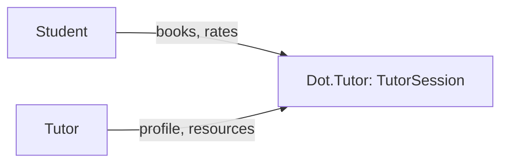

# Dot.Tutor

> **Platform-owned source:** [Dot.Tutor's wiki.md](https://github.com/sakhilebhayi/Dot.Tutor/blob/main/wiki.md) — the platform's own knowledge home. This document is Dot.Brain's ingested view; the wiki is authoritative for what the platform actually is.

## 1. Purpose & Business Domain

A tutoring marketplace, early-stage: `TutorProfile`, `TutorSession`, `Subject`, `LessonResource`, `SessionRating` are fully modeled and a real dark-themed ops dashboard queries them, but there is no booking UI or controller yet — a prospective student or tutor cannot actually create a session through this app today. Earlier README claims of AI summaries, learning paths, video classrooms, S3, Scout, and Redis/Horizon do not exist in the codebase — corrected during integration.

## 2. Entities Owned

| Entity | Graph node type | Natural key | Notes |
|---|---|---|---|
| TutorProfile | `entity:asset` | profile ID | One per tutoring user |
| TutorSession | `entity:process` | session ID | Booking record — no booking UI creates these yet |
| Subject | `entity:asset` | subject ID | Catalog |
| LessonResource | `entity:asset` | resource ID | Attached to sessions/subjects |
| SessionRating | `outcome` | rating ID | Post-session feedback |

## 3. Events Emitted

None currently.

## 4. Knowledge Packs Published

None. No DKP manifest or publish pipeline exists.

## 5. Intelligence Consumed

None currently subscribed.

## 6. Cross-Platform Relationships

No cross-platform data exchange with other Dot Ecosystem platforms yet beyond shared ecosystem SSO and the shared `infodot` database.

## 7. Tenancy Model

Single-`user_id`-owned; no `team_id` or admin role exists in this schema. The integration pass found and fixed a real, live gap: `/dashboard` queried `TutorSession` with zero scoping — any logged-in user could see every other user's session details (who they're paired with, subject, time, and dollar amount). Fixed: session-list queries now scope to the signed-in user's own sessions (as student or as the owning tutor profile); aggregate KPI counts stay platform-wide since they carry no PII. No by-ID show/edit routes exist yet to audit for IDOR, since the booking UI itself is unbuilt — flagged as a must-build-with-Policy item for whenever that ships.

## 8. Dopamine Surface

Not yet applicable — no booking or session UI exists to carry engagement mechanics either way.

## 9. Active Recommendations

None — no Knowledge Pack publishing yet.

## 10. Incident History Summary

**Real, live cross-user data disclosure** (§7) on session pairing/subject/amount — closed 2026-08-02, same day found. Also resolved during integration: a branding question about whether `dot.logos10.png` in this repo was the owner's personal brand mark (as assumed based on a same-named file elsewhere) — verified directly by viewing the image; it is genuinely Dot.Tutor's own logo (teacher icon + "dot.tutor" wordmark), a filename coincidence, not a misattribution. Used as the real logo.

## Change Log

| Version | Date | Author | Change |
|---|---|---|---|
| 1.0.0 | 2026-08-02 | Repository Steward Agent | Initial registration. Platform audited: SSO contract verified, a live cross-user session-data disclosure fixed on /dashboard, branding resolved (confirmed dot.logos10.png is this platform's real logo, not a misplaced personal mark), leftover "coming soon" template removed, README corrected to match the real (booking-UI-incomplete) state. |

## Open Questions

| Question | Owner → Approver |
|---|---|
| Should tutoring sessions gain `team_id` scoping (e.g. for tutoring organizations), or stay single-user? | Tutor Platform Lead → Chief Architect |
| No booking UI/controller exists yet — is building it the next priority, or is this platform intentionally paused at the schema+dashboard stage? | Tutor Platform Lead → Executive Sponsor |
| `composer.json` still names the project `laravel/laravel`; a dead `ANTHROPIC_API_KEY` config exists with no service class using it. | Tutor Platform Lead → Repository Steward Agent |
