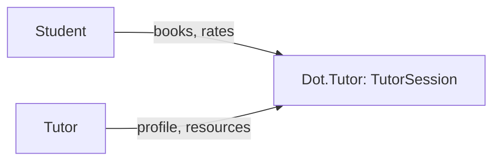

# Dot.Tutor

> **Platform-owned source:** [Dot.Tutor's wiki.md](https://github.com/sakhilebhayi/Dot.Tutor/blob/main/wiki.md) — the platform's own knowledge home. This document is Dot.Brain's ingested view; the wiki is authoritative for what the platform actually is.

## 1. Purpose & Business Domain

A tutoring marketplace: `TutorProfile`, `TutorSession`, `Subject`, `LessonResource`, `SessionRating` are fully modeled, a real dark-themed ops dashboard queries them, and — as of a 2026-08-02 second pass — a real booking flow exists (browse tutors, view a profile, book a session, view/cancel it), so a prospective student can now actually create a session through this app. `LessonResource` upload and `SessionRating` still have no UI, and no session ever progresses past `pending` to `confirmed`/`completed` yet. Earlier README claims of AI summaries, learning paths, video classrooms, S3, Scout, and Redis/Horizon do not exist in the codebase — corrected during integration.

## 2. Entities Owned

| Entity | Graph node type | Natural key | Notes |
|---|---|---|---|
| TutorProfile | `entity:asset` | profile ID | One per tutoring user |
| TutorSession | `entity:process` | session ID | Booking record — created via the real booking flow (`TutorBookingController`) as of 2026-08-02 |
| Subject | `entity:asset` | subject ID | Catalog |
| LessonResource | `entity:asset` | resource ID | Attached to sessions/subjects |
| SessionRating | `outcome` | rating ID | Post-session feedback |

## 3. Events Emitted

None currently.

## 4. Knowledge Packs Published

None. No DKP manifest or publish pipeline exists.

## 5. Intelligence Consumed

None currently subscribed.

## 6. Cross-Platform Relationships

No cross-platform data exchange with other Dot Ecosystem platforms yet beyond shared ecosystem SSO and the shared `infodot` database.

## 7. Tenancy Model

Single-`user_id`-owned; no `team_id` or admin role exists in this schema. The integration pass found and fixed a real, live gap: `/dashboard` queried `TutorSession` with zero scoping — any logged-in user could see every other user's session details (who they're paired with, subject, time, and dollar amount). Fixed: session-list queries now scope to the signed-in user's own sessions (as student or as the owning tutor profile); aggregate KPI counts stay platform-wide since they carry no PII. **The booking UI built 2026-08-02 shipped `TutorSessionPolicy` from day one** — `showSession`/`cancel` gate on it, and `TutorProfile::show()` only exposes `approved` profiles by ID — so the by-ID surface this section flagged as unaudited no longer exists unaudited.

## 8. Dopamine Surface

Not yet applicable — the booking flow (§7) is transactional (browse → book → view/cancel), with no progress/streak/achievement surface built. Worth a dedicated pass once session completion (rate/review) exists, per Dot.Brain's ethical-engagement manifesto.

## 9. Active Recommendations

None — no Knowledge Pack publishing yet.

## 10. Incident History Summary

**Real, live cross-user data disclosure** (§7) on session pairing/subject/amount — closed 2026-08-02, same day found. Also resolved during integration: a branding question about whether `dot.logos10.png` in this repo was the owner's personal brand mark (as assumed based on a same-named file elsewhere) — verified directly by viewing the image; it is genuinely Dot.Tutor's own logo (teacher icon + "dot.tutor" wordmark), a filename coincidence, not a misattribution. Used as the real logo.

## Change Log

| Version | Date | Author | Change |
|---|---|---|---|
| 1.0.0 | 2026-08-02 | Repository Steward Agent | Initial registration. Platform audited: SSO contract verified, a live cross-user session-data disclosure fixed on /dashboard, branding resolved (confirmed dot.logos10.png is this platform's real logo, not a misplaced personal mark), leftover "coming soon" template removed, README corrected to match the real (booking-UI-incomplete) state. |
| 1.1.0 | 2026-08-02 | Sakhile Bhayi | **Booking flow built** (`TutorBookingController`, `TutorSessionPolicy`, browse/show/store/cancel routes and views) — the platform's core missing piece from 1.0.0 is closed. §1/§2/§7/§8 updated; open question about booking-UI priority resolved (it shipped). |

## Open Questions

| Question | Owner → Approver |
|---|---|
| Should tutoring sessions gain `team_id` scoping (e.g. for tutoring organizations), or stay single-user? | Tutor Platform Lead → Chief Architect |
| No session ever progresses past `pending` to `confirmed`/`completed`, and `LessonResource`/`SessionRating` still have no UI — next priority for a third pass? | Tutor Platform Lead → Executive Sponsor |
| `composer.json` still names the project `laravel/laravel`; a dead `ANTHROPIC_API_KEY` config exists with no service class using it. | Tutor Platform Lead → Repository Steward Agent |
